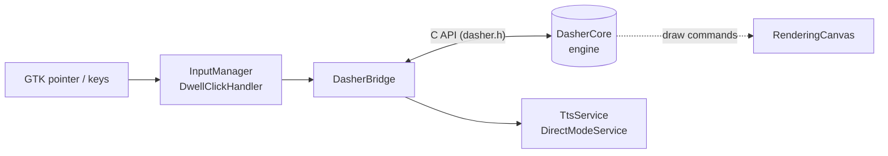

# Dasher for GTK

[](https://github.com/dasher-project/Dasher-GTK/actions/workflows/cmake-multi-platform.yml)
[](./LICENSE)

Dasher is an information-efficient text-entry interface, driven by continuous
pointing gestures. It lets you write using eye gaze, a mouse, a switch, a
joystick, or touch — designed for accessibility and augmentative communication
(AAC).

This is the **GTK** frontend, built on the shared
[DasherCore](https://github.com/dasher-project/DasherCore) engine.

> **[dasher.at](https://dasher.at)** — downloads, user docs, and live demo
> **[Feature status](https://dasher.at/status/)** — what each platform supports
> **[All repos](https://github.com/dasher-project)** — engine, frontends, design guide

## Status

> **In development** — early-stage GTK4 frontend aiming to replace Dasher 5.
> See the [feature matrix](https://dasher.at/status/) for what's implemented.

## Install

Prebuilt **Linux** packages are attached to each [Release](../../releases):

- **Flatpak** — needs the GNOME 50 runtime
  (`flatpak install flathub org.gnome.Platform//50`), then
  `flatpak install --user Dasher.flatpak` and
  `flatpak run org.alternativeinterface.dasher`.
- **AppImage** — `chmod +x Dasher-x86_64.AppImage && ./Dasher-x86_64.AppImage`
  (self-contained).

macOS and Windows aren't packaged yet — build from source (below). How the
artifacts are produced is described under [Packaging & releases](#packaging--releases).

## Build

### Prerequisites

| Platform | Command |
|----------|---------|
| macOS | `brew install gtk4 gtkmm4 pkg-config cmake` |
| Linux (Debian/Ubuntu) | `apt-get install build-essential libgtk-4-dev libgtkmm-4.0-dev git cmake pkg-config libspeechd-dev libclang-dev` |
| Windows | Install GTK from [GVSBuild](https://github.com/wingtk/gvsbuild/releases) to `C:\gtk`, add `C:\gtk\bin` to PATH. Requires CMake, Git, and MSVC or Clang. Use an optimized release build for binary compatibility. |

All platforms additionally require a **Rust toolchain** (`cargo`) to build the bundled
`rust-tts-wrapper`. Install it from [rustup.rs](https://rustup.rs). On Linux the
`system` TTS feature binds speech-dispatcher via bindgen, hence `libspeechd-dev`
(headers) and `libclang-dev` (for bindgen) above.

### Steps

```sh
git clone --recursive https://github.com/dasher-project/Dasher-GTK.git
cd Dasher-GTK
mkdir build && cd build
cmake ..
cmake --build . --config Release --parallel
```

The binary and all runtime files are placed in `build/Dasher/`.

### Running

Dasher must be launched from the `build/Dasher/` directory so it can find its
data files. The binary is `Dasher` on macOS/Windows and lowercase `dasher` on
Linux:

```sh
cd build/Dasher
./dasher      # 'Dasher' on macOS/Windows
```

### Running the Tests

Lightweight unit tests live in `tests/` and build alongside the app; doctest is
fetched automatically at configure time, so no extra dependency is required.
After configuring and building, run the suite with ctest:

```sh
ctest --test-dir build --output-on-failure
```

CI runs these tests on every push as part of the multi-platform workflow.

### TTS Support

The `rust-tts-wrapper` submodule provides text-to-speech support. It is included
automatically when cloning with `--recursive`. CMake builds and links it if the
submodule is present.

- **macOS**: builds with `avsynth,cloud` features (no local speech-dispatcher needed)
- **Linux**: builds with `system,cloud` features (uses speech-dispatcher + cloud engines); needs `libspeechd-dev` and `libclang-dev` (see Prerequisites)
- **Windows**: builds with `sapi,cloud` features (uses the Windows SAPI engine plus cloud engines)
- All platforms need a Rust toolchain (`cargo`) on `PATH` to compile the wrapper

Override the default feature set with `-DTTS_WRAPPER_FEATURES=...` at configure
time — e.g. `-DTTS_WRAPPER_FEATURES=cloud` for a cloud-only build with no
speech-dispatcher dependency (this is what the Flatpak uses).

### Runtime Data Files

The CMake build copies data files into `build/Dasher/Data/`. The directory layout
after building:

```
build/Dasher/
├── Dasher              # executable
├── libdasher.dylib     # macOS (libdasher.so on Linux, dasher.dll on Windows)
├── UIStyle.css
├── Data/
│   ├── alphabet.*.xml  # alphabet definitions
│   ├── color*.xml      # colour schemes
│   └── training*.txt   # language model training data (PPM)
├── Strings/
│   └── strings_*.json  # UI translations
└── Resources/
    └── License/
```

Dasher uses a PPM (Prediction by Partial Match) language model trained on text
files. Each alphabet definition specifies a `trainingFilename`
(e.g. `training_english_GB.txt`). Without training data, all letter boxes will be
the same size and prediction will not work. Training files are copied from
`DasherCore/Data/training/` during the build; if letters appear uniformly sized
after launch, run from `build/Dasher/` so the `"Data"` relative path resolves, and
rebuild if stale (`cmake --build build`).

### Known Issues

- `bad_variant_access` / `std::get: wrong index for variant` warnings on startup
  are non-fatal — the GTK UI queries some CAPI parameters with the wrong getter
  type (string vs long); they don't affect functionality. Tracked in
  [#17](../../issues/17).
- In packaged builds the custom `UIStyle.css` isn't loaded — it's resolved
  relative to the working directory, so the app falls back to default GTK
  styling. Tracked in [#18](../../issues/18).

## Packaging & releases

Linux is distributed as **Flatpak** and **AppImage**, both built by
[`.github/workflows/publish.yml`](.github/workflows/publish.yml).

**Flatpak** — manifest: `packaging/flatpak/org.alternativeinterface.dasher.yaml`
(GNOME 50 runtime + the `rust-stable` SDK extension; builds `rust-tts-wrapper`
with `TTS_WRAPPER_FEATURES=cloud`). The manifest bundles the working tree via a
`type: dir` source, so run `flatpak-builder` from **outside** the repo to avoid
copying its build directory into itself. `--install-deps-from=flathub` pulls the
runtime, SDK and `rust-stable` extension at the versions the manifest declares:

```sh
flatpak remote-add --user --if-not-exists flathub https://flathub.org/repo/flathub.flatpakrepo
repo=$(pwd)
mkdir -p /tmp/dasher-fb && cd /tmp/dasher-fb
flatpak-builder --user --install --force-clean --install-deps-from=flathub build \
    "$repo/packaging/flatpak/org.alternativeinterface.dasher.yaml"
flatpak run org.alternativeinterface.dasher
```

**AppImage** — `bash packaging/build-appimage.sh` produces `Dasher-x86_64.AppImage`.

**Cutting a release** — push a `v*` tag; the publish workflow builds both
artifacts and attaches them to a new GitHub Release:

```sh
git tag v0.2.3 && git push origin v0.2.3
```

## Architecture

This frontend consumes DasherCore through its **C API** (`src/Engine/DasherBridge.cpp`,
backed by `dasher.h`). `DasherBridge` owns the engine handle, feeds it GTK pointer
input, and receives draw commands that `RenderingCanvas` renders onto a GTK widget.
`InputManager`/`DwellClickHandler` translate raw input, and `TtsService` /
`DirectModeService` handle output and spoken feedback.



See [DasherCore's C API](https://github.com/dasher-project/DasherCore/blob/main/docs/C_API.md)
for the engine contract.

## Repository layout

| Path | Purpose |
|-------|---------|
| `src/Engine/` | `DasherBridge` + `CommandRenderer`: C API bridge to DasherCore |
| `src/Input/` | `InputManager`, `DwellClickHandler` (pointer/switch input) |
| `src/Output/` | `TtsService`, `DirectModeService` (speech + output modes) |
| `src/Preferences/` | Settings UI (`PreferencesWindow`, `SettingsSection`) |
| `src/UIComponents/` | Reusable GTK widgets (canvas, synced controls) |
| `tests/` | doctest unit tests |
| `packaging/` | Flatpak manifest + AppImage build script (Linux distribution) |
| `DasherCore/` | DasherCore submodule (do not edit here — PR upstream) |
| `rust-tts-wrapper/` | TTS wrapper submodule |
| `Thirdparty/SDL` | SDL submodule (joystick input) |

## Contributing

See [CONTRIBUTING.md](./CONTRIBUTING.md) for build details, code style, and DCO
sign-off. For project-wide conventions (code of conduct, RFCs, security), see the
[org contributing guide](https://github.com/dasher-project/.github/blob/main/CONTRIBUTING.md).

Please file bug reports in the [issues](../../issues) of this repository. To join
the development group, send a pull request or reach us via
[Slack (OpenAAC)](https://join.slack.com/t/openaac/shared_invite/enQtNTQwNDgwODYyNjU5LTAwODNmZjM4ZmJmOTJkYTY2MWZkNjc0MDQ0NTcwMTRmMzY0MWI3OWJiNGYwZGIzMzc2YTk2N2FiY2JlYTI5Njc).

## License

MIT — see [LICENSE](./LICENSE).
